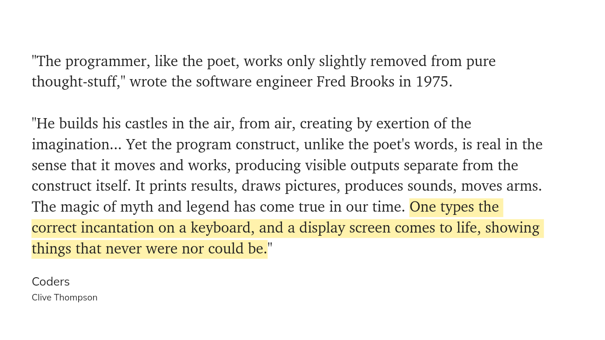

# Writing code with generative AI

“In the beginning was the Word.”

What is the difference between knowing things and doing things?

Words have power. We see evidence of this across all the professions, where the words we use give us access to a community, and a sense of identity.

And increasingly, we see more and more people developing the ability to turn words into action. To turn ideas into code.

> I don’t think most non-coders realize how much ChatGPT can automate tasks for you, or come up with ways of extending your abilities, by just writing simple code that works... ([Ethan Mollick, 2023](https://twitter.com/emollick/status/1695191857532170350)).

We’re almost at a point where anyone can build [single-use software applications](https://www.mrowe.co.za/blog/2023/04/weekly-digest-24-30-apr-2023/) using natural language. I can think of a thousand use-cases where you might need a small piece of software to accomplish a goal that almost no-one else is interested in. No-one is going to build that application for you to get this thing done. Soon, you’ll simply tell your AI assistant what you want, and it’ll build the application you need.

For example, here's Ethan Mollick again, using *Code Interpreter*[^1] to develop an interactive website illustrating the Central Limit Theorem in statistics, using only two prompts.

- Chat: [https://chat.openai.com/share/51a80812-2106-4ef3-bede-661f76b9f689](https://t.co/WpcGLJR8XP).
- Site: [https://incredible-concha-e78fe3.netlify.app](https://t.co/9S1GiJBmWp).

If it takes ten minutes to build an app using natural language, and each app we build is simply a ‘control app’ that uses APIs to connect to plugins and other AI models, then do we still need Word, or Excel, or Outlook? Do we need Google? Do we need lawyers, or physiotherapists?

## Related

- [Open Interpreter](https://github.com/KillianLucas/open-interpreter/): An open-source, locally running implementation of OpenAI's Code Interpreter.

---

# Additional reading

Carrigan, M. (2023). Code Interpreter for ChatGPT is mind blowing. (2023, July 31). Retrieved from https://markcarrigan.net/2023/07/31/code-interpreter-for-chatgpt-is-mind-blowing

[^1]: Code Interpreter is a tool developed by OpenAI to support programming by both novice and experienced software developers. It is available through the paid version of ChatGPT (i.e. ChatGPT Plus).